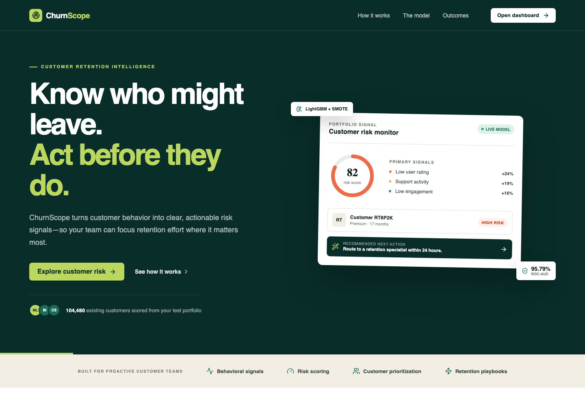

<div align="center">
  

  <h1>ChurnScope</h1>

  <h3>Customer Churn Intelligence</h3>

  <p>
    
    
    
    
    
    
  </p>

  <p>
    <a href="https://churnscope.pages.dev/"><strong>View Live Project ↗</strong></a>
    &nbsp;·&nbsp;
    <a href="#product-preview">Product Preview</a>
    &nbsp;·&nbsp;
    <a href="#modeling-decisions">Modeling Decisions</a>
    &nbsp;·&nbsp;
    <a href="#project-structure">Architecture</a>
    &nbsp;·&nbsp;
    <a href="#setup">Quick Start</a>
  </p>
</div>

---

**ChurnScope** predicts which streaming subscribers are most likely to leave and turns those predictions into practical retention actions. It combines account, billing, support, and engagement behavior in a production-ready LightGBM pipeline, then presents the results through a React customer-risk dashboard backed by FastAPI.

> Retention teams should not have to search through thousands of records to find the customers who need attention. ChurnScope makes the risk visible—and the next action clear.

The modeling workflow comes from `Customer_Churn_Prediction.ipynb`. The production application uses the saved LightGBM model, a reusable preprocessing pipeline, FastAPI, and React. The React application also has a static-first mode for free Cloudflare deployment.

## Product Preview

<p align="center">
  <a href="https://churnscope.pages.dev/">
    
  </a>
</p>

<p align="center"><em>Customer retention landing page — click the image to open the live project.</em></p>


## Dataset

The project uses the Kaggle dataset:

`https://www.kaggle.com/datasets/safrin03/predictive-analytics-for-customer-churn-dataset`

Download it with:

```bash
bash scripts/download_dataset.sh
```

The model was trained on `data/train.csv`. The dashboard treats `data/test.csv` as the current customer portfolio and scores all 104,480 records with the saved artifacts.

```text
data/train.csv
```

Main dataset fields include:

- Account and billing: `AccountAge`, `MonthlyCharges`, `TotalCharges`, `PaymentMethod`, `PaperlessBilling`
- Subscription and content: `SubscriptionType`, `ContentType`, `MultiDeviceAccess`, `DeviceRegistered`, `GenrePreference`
- Engagement: `ViewingHoursPerWeek`, `AverageViewingDuration`, `ContentDownloadsPerMonth`, `WatchlistSize`
- Customer signals: `UserRating`, `SupportTicketsPerMonth`, `Gender`, `ParentalControl`, `SubtitlesEnabled`
- Target: `Churn`

## Modeling Decisions

### 1. Feature Engineering

The notebook does not train directly on only the raw columns. It creates behavioral and financial features that better describe customer churn risk:

| Engineered feature | Purpose |
| --- | --- |
| `TotalSpendingRatio` | Average spending per account age unit |
| `MonthlyChangeInCharges` | Difference between current monthly charge and historical average spend |
| `ViewingIntensity` | Viewing hours relative to watchlist size |
| `SupportEngagementRatio` | Support tickets relative to viewing activity |
| `ContentConsumptionScore` | Combined content engagement score |
| `CustomerTenureEngagement` | Tenure adjusted by viewing behavior |

These features were chosen because churn is not only a billing problem. It is also affected by engagement, support friction, customer satisfaction, and tenure.

### 2. Feature Selection

The notebook first trained a Random Forest model to inspect feature importance. Based on that analysis, the final model kept the strongest predictive fields:

```text
ContentConsumptionScore
AccountAge
AverageViewingDuration
TotalCharges
SupportEngagementRatio
ViewingHoursPerWeek
CustomerTenureEngagement
MonthlyCharges
TotalSpendingRatio
UserRating
ContentDownloadsPerMonth
ViewingIntensity
WatchlistSize
SupportTicketsPerMonth
SubscriptionType
```

This reduces noise from low-signal categorical fields and keeps the deployed model focused on the fields that most directly explain churn behavior.

### 3. Class Imbalance Handling

The notebook uses `SMOTE` because churn datasets are often imbalanced. Without resampling, a model can look accurate while under-detecting churners.

SMOTE was applied to the training data so the model had enough minority-class examples to learn churn patterns. This improves recall and F1 for churn detection, which matters more than raw accuracy in retention workflows.

### 4. Model Comparison

The notebook compares Random Forest and LightGBM after SMOTE.

Random Forest with SMOTE performed well on the test set:

| Metric | Random Forest + SMOTE |
| --- | ---: |
| Accuracy | 0.8731 |
| Precision | 0.8624 |
| Recall | 0.8888 |
| F1 | 0.8754 |
| ROC-AUC | 0.9475 |
| Balanced Accuracy | 0.8730 |

However, its training ROC-AUC was `1.0`, which indicates overfitting. Because of that, it was not selected as the final model.

LightGBM with SMOTE had similar test strength but much closer train/test behavior:

| Split | Accuracy | ROC-AUC |
| --- | ---: | ---: |
| Test | 0.88 | 0.9397 |
| Train | 0.89 | 0.9433 |

This is why LightGBM became the preferred model family.

### 5. Hyperparameter Tuning

The notebook used `GridSearchCV` with `scoring="f1"` and `cv=3`.

F1 was chosen because this is a churn detection problem where both false positives and false negatives matter:

- False negatives mean missing customers who may churn.
- False positives mean wasting retention budget on customers who may not need intervention.

The tuning grid was intentionally constrained:

```python
params = {
    "max_depth": [5, 10],
    "n_estimators": [300, 500, 700],
    "learning_rate": [0.1],
    "num_leaves": [20],
    "reg_alpha": [0.1],
    "reg_lambda": [0.1],
}
```

The constraints were deliberate:

- `max_depth` was limited to control tree complexity.
- `num_leaves` was fixed at `20` to reduce overfitting risk.
- `reg_alpha` and `reg_lambda` were included to regularize the model.
- `learning_rate=0.1` kept training efficient while still allowing strong performance.
- `n_estimators` was searched because boosting round count directly affects underfitting/overfitting.

Best parameters from the tuning section:

```python
{
    "learning_rate": 0.1,
    "max_depth": 5,
    "n_estimators": 700,
    "num_leaves": 20,
    "reg_alpha": 0.1,
    "reg_lambda": 0.1,
}
```

The tuned model reached:

| Split | Accuracy | ROC-AUC |
| --- | ---: | ---: |
| Test | 0.89 | 0.9409 |
| Train | 0.90 | 0.9565 |

### 6. Final Model Choice

The final saved model uses LightGBM with SMOTE and stronger boosting capacity:

```python
LGBMClassifier(
    learning_rate=0.1,
    max_depth=20,
    n_estimators=900,
    num_leaves=20,
    reg_alpha=0.1,
    reg_lambda=0.1,
    random_state=42,
    verbosity=-1,
)
```

Final notebook evaluation:

| Split | Accuracy | ROC-AUC |
| --- | ---: | ---: |
| Test | 0.90 | 0.9579 |
| Train | 0.90 | 0.9588 |

This was selected because it improved ROC-AUC while keeping train and test metrics close. The small train/test gap suggests the model generalizes better than the Random Forest baseline.

## Productionization Decisions

The notebook was converted into reusable code:

- `src/churn_features.py` contains deterministic feature engineering.
- `src/churn_service.py` loads artifacts, scores customers, assigns risk bands, and generates recommendations.
- `src/train.py` retrains the model from a CSV.
- `src/api.py` exposes predictions and portfolio analytics through FastAPI.
- `frontend/` contains the React landing page and dashboard.

The deployed preprocessing pipeline is intentionally simpler than the experimental notebook pipeline. It focuses on the stable engineered fields, categorical mapping for `SubscriptionType`, and feature selection. This makes the service easier to run across environments and avoids brittle notebook-only transformations.

Operational risk bands:

| Risk band | Churn probability |
| --- | ---: |
| High | `>= 50%` |
| Medium | `20%` to `49.9%` |
| Low | `< 20%` |

## Project Structure

```text
.
├── frontend/
│   ├── src/
│   │   ├── App.jsx
│   │   └── styles.css
│   ├── package.json
│   └── vite.config.js
├── scripts/
│   └── download_dataset.sh
├── src/
│   ├── api.py
│   ├── churn_features.py
│   ├── churn_service.py
│   ├── predict.py
│   └── train.py
├── tests/
│   ├── test_churn_features.py
│   └── test_churn_service.py
├── Customer_Churn_Prediction.ipynb
├── preprocessing_pipeline.pkl
├── smote_lgbm.pkl
├── requirements.txt
├── Dockerfile
└── docker-compose.yml
```

## Setup

Use Python 3.11.

On macOS, LightGBM may require OpenMP:

```bash
brew install libomp
```

Create and activate an environment:

```bash
python3.11 -m venv .venv
source .venv/bin/activate
pip install -r requirements.txt
```

Download the dataset:

```bash
bash scripts/download_dataset.sh
```

## Run The Application Locally

Start the API:

```bash
uvicorn src.api:app --reload
```

In a second terminal, start React:

```bash
cd frontend
npm install
npm run dev
```

Open `http://localhost:5173`.

The dashboard includes:

- Portfolio KPIs and risk-band distribution
- Existing-customer search, filters, sorting, and detail views
- Model-scored churn probability and retention recommendations
- Interactive single-customer predictions
- Model metrics, pipeline stages, and global feature importance

By default, React reads the pre-scored portfolio and compact LightGBM trees from
`frontend/public/data`. The customer explorer and prediction form therefore work
without a running Python API.

To explicitly use FastAPI during frontend development:

```bash
VITE_API_MODE=server npm run dev
```

API health check:

```bash
curl http://localhost:8000/health
```

Prediction request:

```bash
curl -X POST http://localhost:8000/predict \
  -H "Content-Type: application/json" \
  -d '{
    "AccountAge": 12,
    "MonthlyCharges": 50.0,
    "TotalCharges": 600.0,
    "SubscriptionType": "Basic",
    "ViewingHoursPerWeek": 10.5,
    "AverageViewingDuration": 2.5,
    "ContentDownloadsPerMonth": 5,
    "UserRating": 4.5,
    "SupportTicketsPerMonth": 1,
    "WatchlistSize": 8
  }'
```

## Retrain The Model

```bash
python src/train.py \
  --data data/train.csv \
  --model-out smote_lgbm.pkl \
  --pipeline-out preprocessing_pipeline.pkl
```

The training script:

1. Loads required raw fields and `Churn`.
2. Applies the preprocessing pipeline.
3. Splits train/test data with stratification.
4. Applies SMOTE to the training split.
5. Fits LightGBM.
6. Prints classification metrics.
7. Saves model and pipeline artifacts.

## Batch Prediction

```bash
python src/predict.py \
  --input data/test.csv \
  --output predictions.csv
```

Output columns include:

- `ChurnPrediction`
- `ChurnProbability`
- `RiskBand`
- `RecommendedAction`

## Tests

```bash
pytest
```

Tests cover:

- Feature engineering output columns
- Scoring output shape
- Missing-column validation
- Customer warnings
- Retention action logic

## Docker

```bash
docker compose up --build
```
